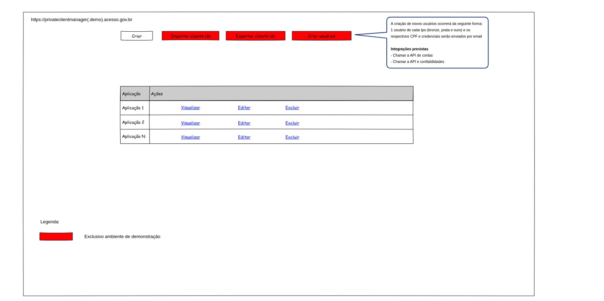
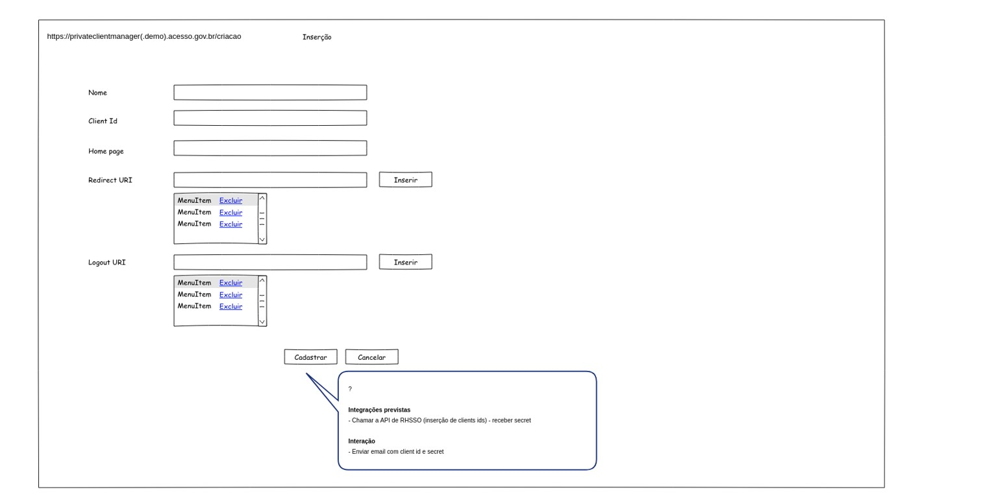
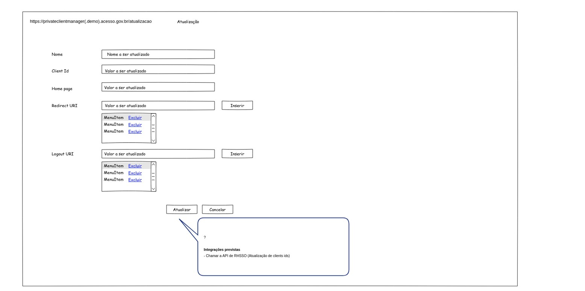
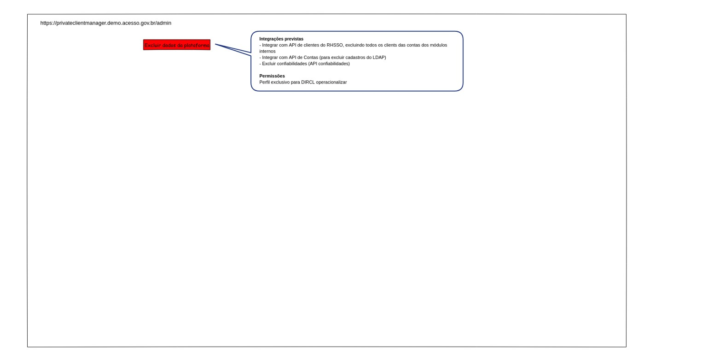
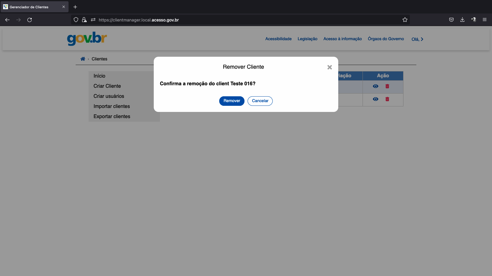
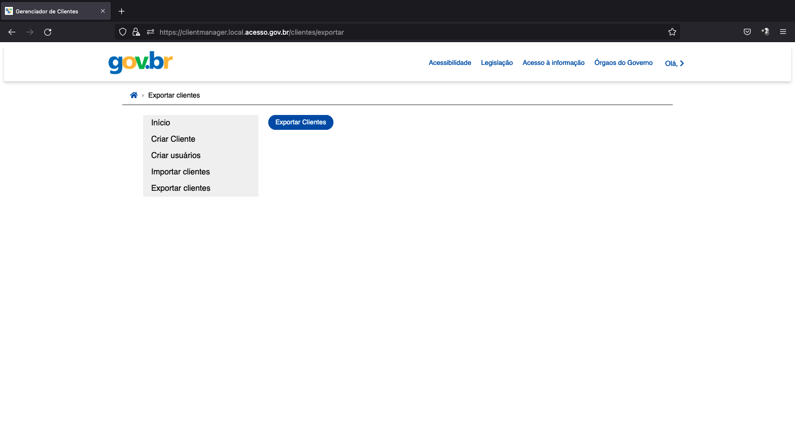
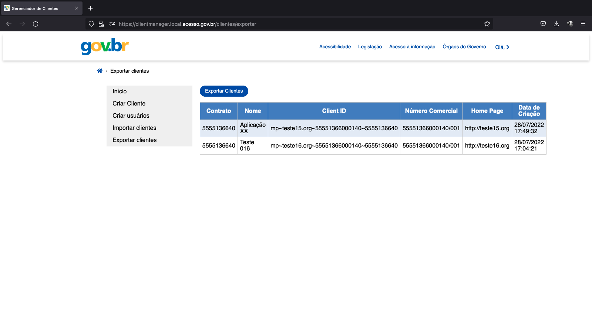
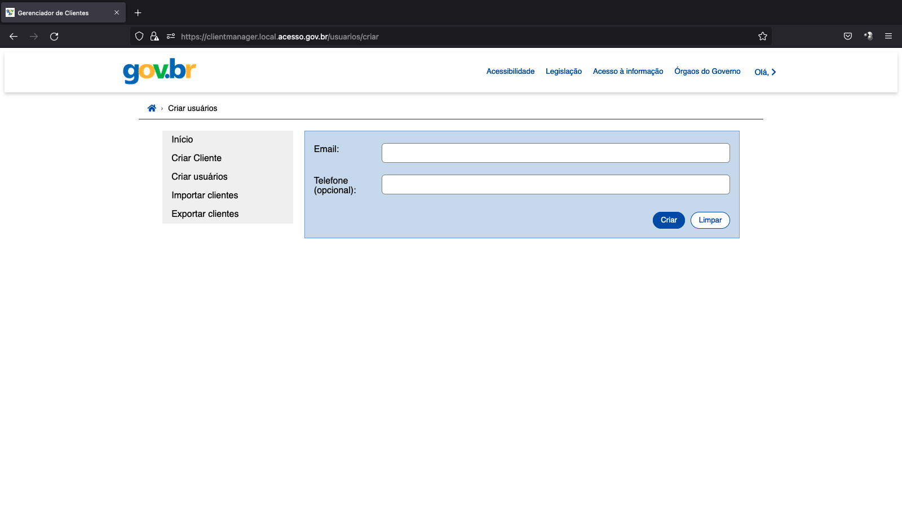
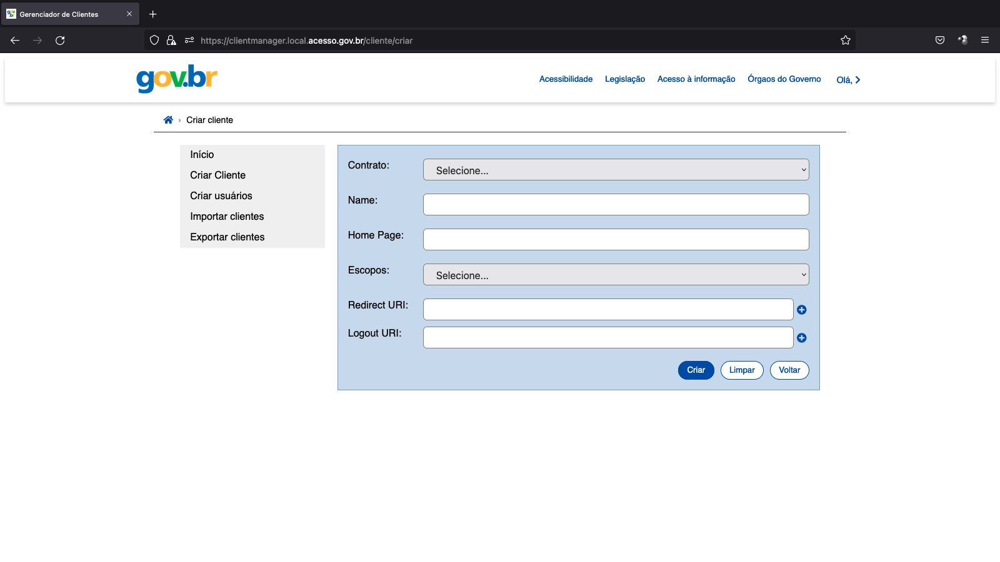
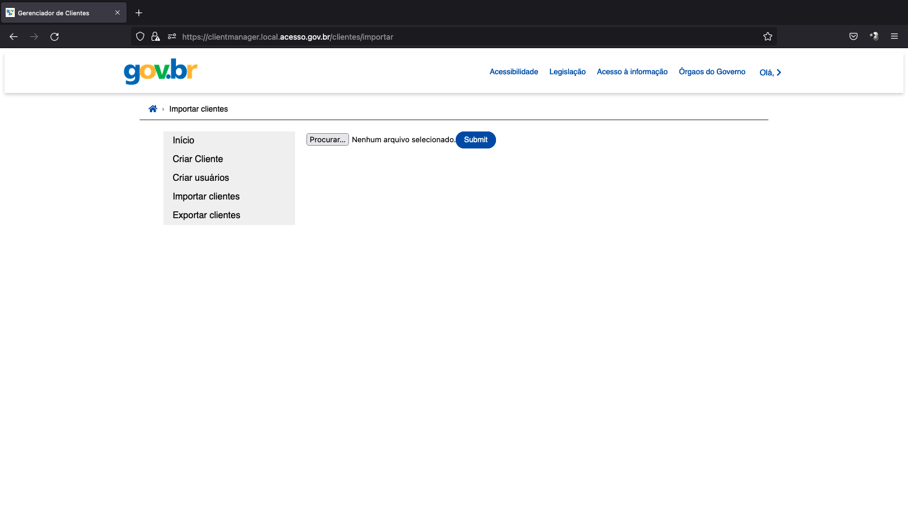

Antes de realizar a integração com o Acesso Gov é necessário configurar os client ids e as secrects. Com esta finalidade foi criado o módulo Client Manager. 

O acesso ao Client Manager é feito através do link ==xxx==

Após acessá-lo será possível realizar várias ações:

1- Tela inicial

2- Inserção

3- Atualização de dados

4- Exclusão de dados

5- Exportar cliente

6- Criar usuário

7- Criar cliente

8- Importar usuário

