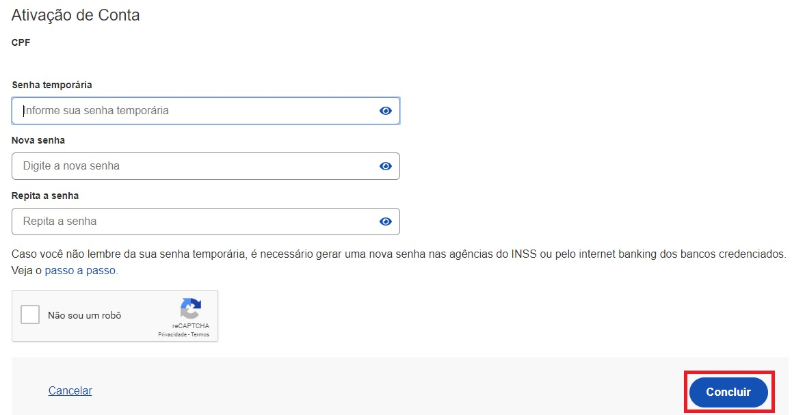

Title: Aquisição do Selo Balcão Presencial (INSS)

1- Cidadão deve ir ao posto do INSS presente na região

2- Atendente do INSS cadastra senha temporária para acesso ao Login Único e entrega ao cidadão

3- Digite o CPF na tela inicial do https://acesso.gov.br e clique no botão Continuar.

4- Cidadão digita senha temporária, nova senha, repete nova senha. Clica no botão Concluir

5- Cidadão adquire Selo Balcão Presencial (INSS). A identificação na Conta gov.br é Selo Cadastro no INSS.

