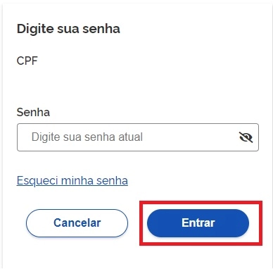
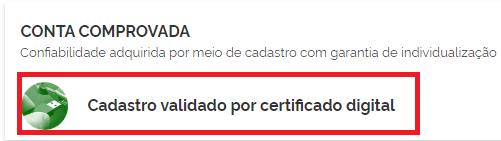
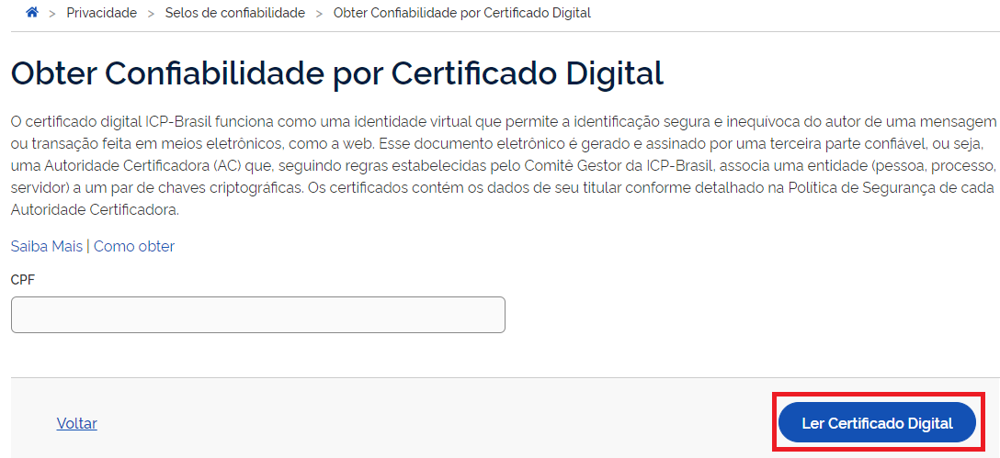

title: Aquisição do Selo Certificado Digital de Pessoa Física

1- Digite o CPF na tela inicial do https://acesso.gov.br e clique no botão Continuar.

2- Digita a senha e clica no botão Entrar.

3- Cidadão deve clicar no menu Privacidade e link Gerenciar lista de selos de confiabilidade.

4- Selecionar o selo Cadastro validado por certificado digital

5- Cidadão aciona o Certificado Digital de Pessoa Fisíca ao computador (Tipo A1 - máquina - ou Tipo A3 - Token). Clica no botão Adquirir Confiabilidade com Certificado Digital

6- Cidadão adquire Selo de Certificado Digital de Pessoa Física.

