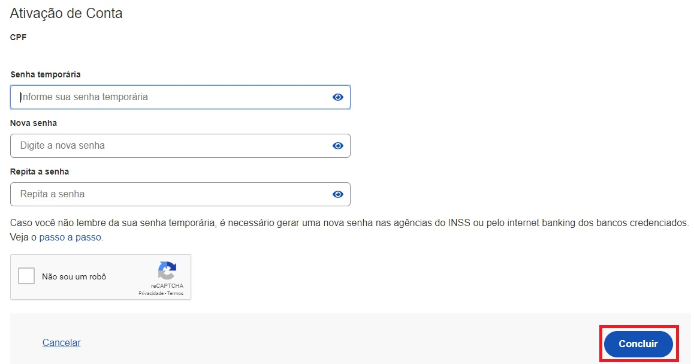

1- Cidadão deve acessar a conta bancária por meio do Internet Banking (versão WEB) para criar senha temporária. O cidadão deverá verificar quais os Bancos Permitidos e Passos para Cada Banco para Gerar Senha Temporária.

2- Cidadão criará senha temporária por meio do acesso ao Internet Banking

3- Digite o CPF na tela inicial do https://acesso.gov.br e clique no botão Continuar

4- Cidadão digita senha temporária, nova senha, repete nova senha. Clica no botão Concluir

5- Cidadão adquire Selo Internet Banking. A identificação na Conta gov.br é Selo Cadastro no INSS.

