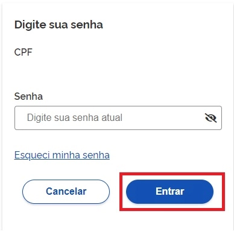

1- Digite o CPF na tela inicial do https://acesso.gov.br e clique no botão Continuar.

2- Digita a senha e clica no botão Entrar.

3- Cidadão deve clicar no menu Privacidade e link Gerenciar lista de selos de confiabilidade.

4- Selecionar o selo do banco credenciado.

5- Clique no botão Ir para do banco credenciado desejado.

6- Siga os procedimentos de cada banco credenciado.

7- Cidadão adquire Selo do Banco Credenciado Desejado.

