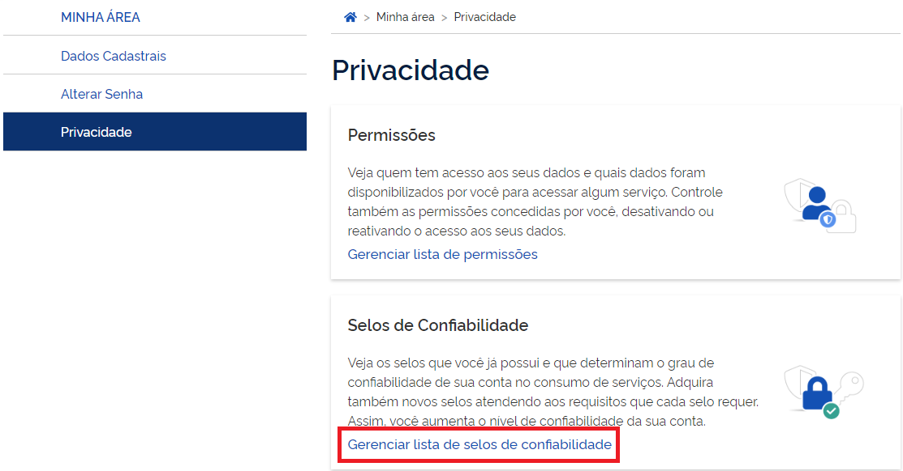

1- Digite o CPF na tela inicial do https://acesso.gov.br e clique no botão Continuar.

2- Digita a senha e clica no botão Entrar.

3- Cidadão deve clicar no menu Privacidade e link Gerenciar lista de selos de confiabilidade.

4- Selecionar o selo Cadastro validado em base de dados de servidores públicos da União

5- Cidadão, servidor público da Únião, deve digitar senha cadastrada no Sistema de Gestão de Acesso SIGAC/SIGEPE site externo. Clica no botão Validar Senha

