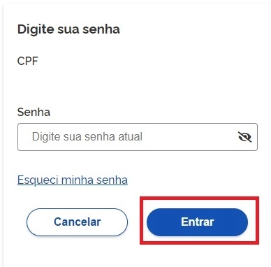
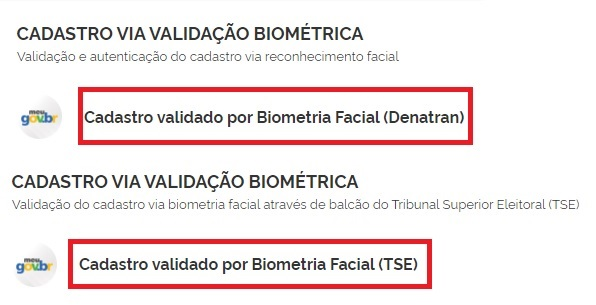
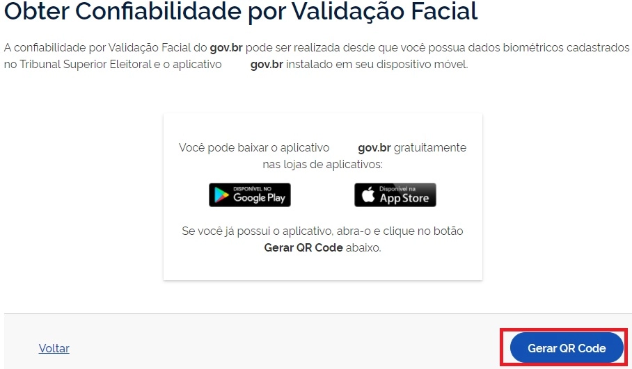
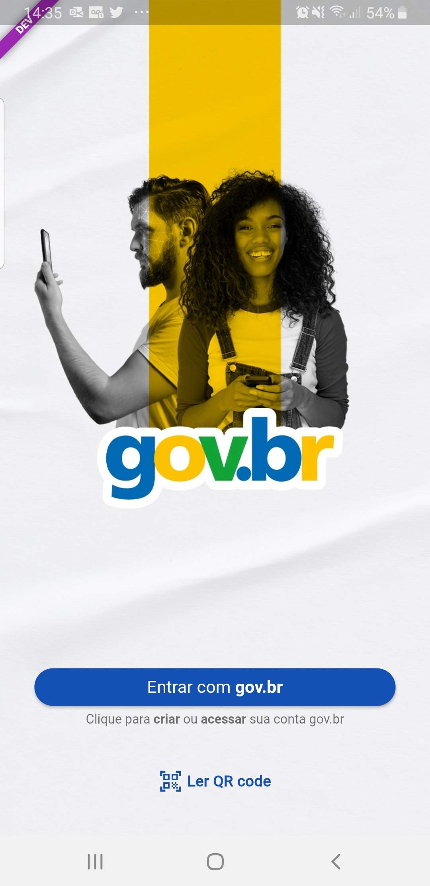
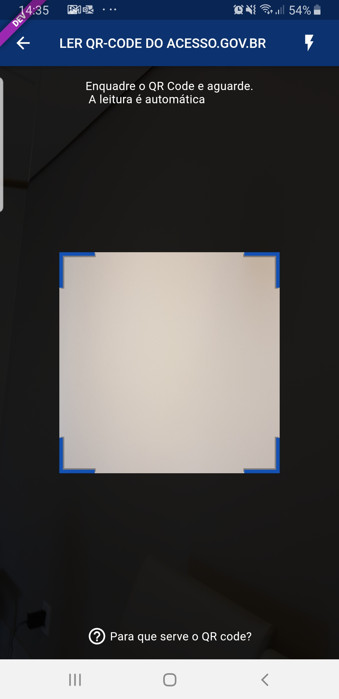
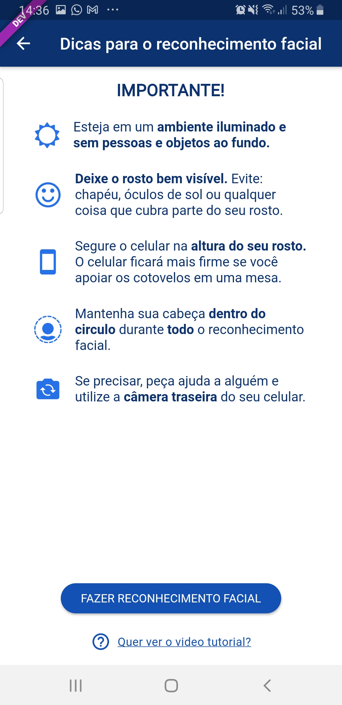
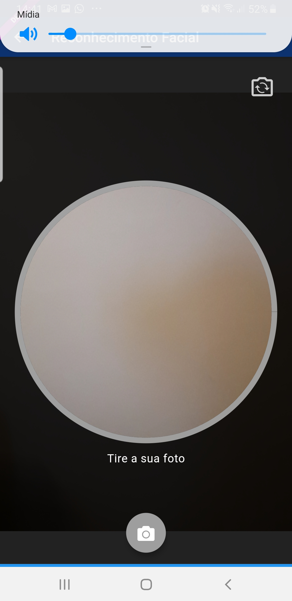
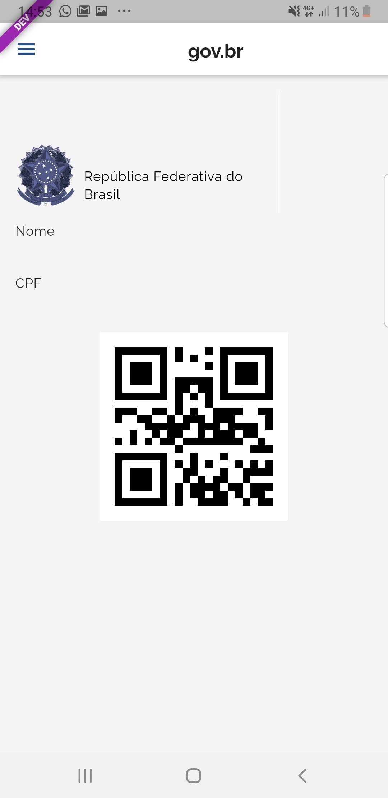

1- Digite o CPF na tela inicial do https://acesso.gov.br e clique no botão Continuar.

2- Digita a senha e clica no botão Entrar.

3- Cidadão deve clicar no menu Privacidade e link Gerenciar lista de selos de confiabilidade.

4- Selecionar o selo Cadastro Valido por Biometria Facial (TSE) ou Cadastro Valido por Biometria Facial (Denatran)

5- Clique no botão Gerar QR CODE

6- Abra o aplicativo gov.br e clique no botão Ler QR Code

7- Aponte o celular para tela do computador com intuito de ler o QR-CODE

8- Clique no botão Fazer Reconhecimento Facial.

9- Posicionar o rosto de frente para câmera celular, clique no botão azul com figura de câmera e siga as orientações de piscar os olhos e sorrir até sistema validar as informações.

10- Clique no botão OK e continue o processo no computador

11- Cidadão adquire Selo Validação Facial

