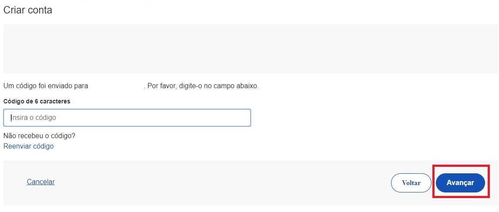

1- Selecione a opção Número do CPF

2- Tenha em mãos um documento de identidade, número do CPF, nome completo, e-mail e número do celular. Preencha CPF, Nome, Marcar as opções Li e estou de acordo com os Termos de uso. e Não sou robô. Clique no botão Avançar

3- Responda as perguntas relacionadas às suas informações pessoais. Clique no botão Avançar.

4- Selecione a opção deseja ativar conta (email ou sms), preenche o conteúdo da opção (conta de email ou telefone celular) e clique no botão Avançar.

5- Digite o código de acesso e clique no botão Avançar

6- Preencha com senha escolhida e clique no botão Concluir para finalizar o cadastro e adquirir Selo Cadastro Básico com Validação de Dados Pessoais.

