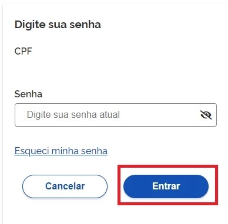
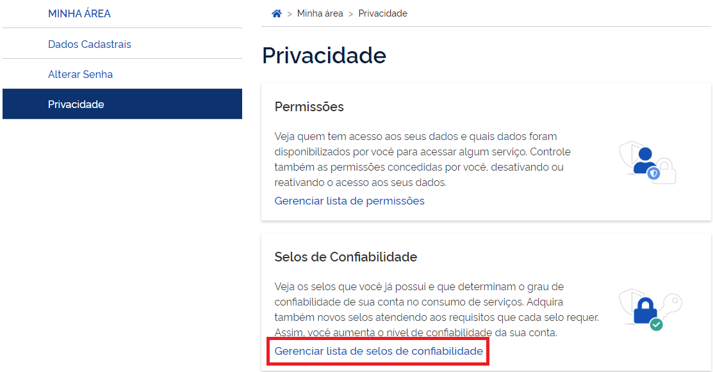
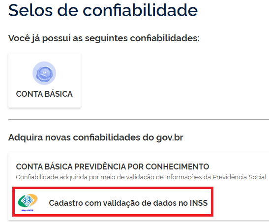
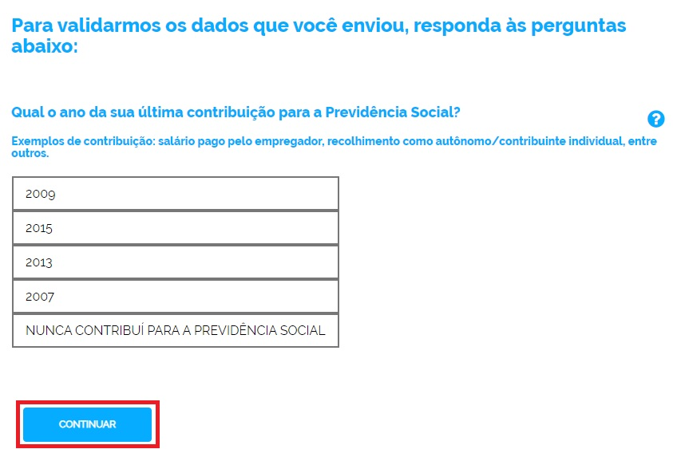

1- Digite o CPF na tela inicial do https://acesso.gov.br e clique no botão Continuar.

2- Digita a senha e clica no botão Entrar.

3- Cidadão deve clicar no menu Privacidade e link Gerenciar lista de selos de confiabilidade.

4- Selecionar o selo Cadastro com validação de dados no INSS

5- Cidadão deve responder todas perguntas referente ao cadastro presente no INSS / Ministério da Economia. Clica no botão Continuar para cada pergunta até finalizar.

6- Cidadão adquire Selo Cadastro no INSS.
