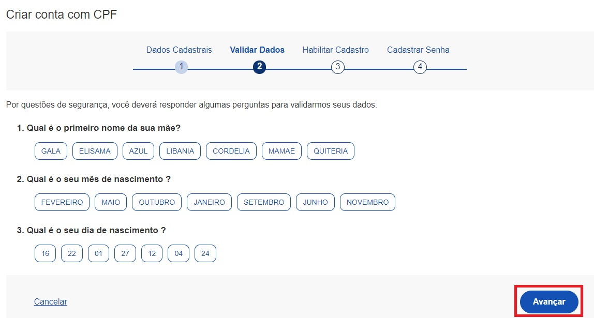
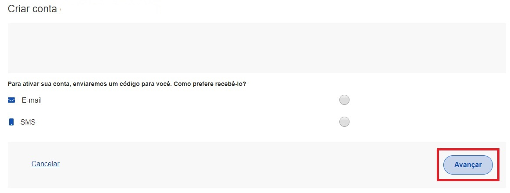

# Níveis de Autenticação

Os Níveis de Autenticação tem como principal característica ser um
recurso de segurança da informação da identidade, que permite
flexibilidade para realização do acesso.

# Selos de Confiabilidade

Os Selos de Confiabilidade estão presentes em cada nível de autenticação
e consistem em orientar para qualificação das contas com a obtenção dos
atributos autoritativos do cidadão a partir das bases oficias de
governo, por meio das quais permitir-se-á a utilização da credencial de
acesso em sistemas internos dos clientes e serviços providos diretamente
ao cidadão.

Um uso possível dos níveis e dos selos consiste em aumentar a confiança
cadastral dos serviços ao aplicar controle de acesso às
funcionalidades mais críticas.

# Catálogo de Confiabilidades

O Catálogo de Confiabilidades permite ao Sistema requisitar a
confiabilidade desejada e, de forma automática, redirecionar para
aplicação integrada após o cidadão adquirir a confiabilidade permitida a
aplicação.

O Catálogo trabalha com as estruturas:

## Níveis

1.  **Nível Bronze**
2.  **Nível Prata**
3.  **Nível Ouro**

## Confiabilidades

1.  Nível Bronze

-   **Selo Cadastro Básico com Validação de Dados Pessoais**: Validação
    do cadastro do cidadão por meio da base de Cadastro de Pessoas
    Físicas (Ministério da Economia / Receita Federal). [Orientações
    para aquisição do Selo Cadastro Básico com Validação de Dados
    Pessoais](./vertopal.com_catalogoconfiabilidades.md#orientacao-1).
-   **Selo Cadastro Básico com Validação de Dados Previdenciários**:
    Validação do cadastro do cidadão por meio da base de Casdatro
    Nacional de Informações Sociais (CNIS / INSS). [Orientações para
    aquisição do Selo Cadastro Básico com Validação de Dados
    Previdenciários](http://faq-login-unico.servicos.gov.br/en/latest/_perguntasdafaq/comoadquirirselocadastrobasicovalidacaodadosprevidenciarios.html).
-   **Selo Balcão Presencial (INSS)**: Validação do cadastro do cidadão
    por meio do Balcão presencial localizado nas agências do INSS.
    [Orientações para aquisição do Selo Balcão Presencial (INSS)](http://faq-login-unico.servicos.gov.br/en/latest/_perguntasdafaq/comoadquirirseloselobalcaopresencialINSS.html).

2.  Nível Prata

-   **Selo Internet Banking**: Validação do cadastro do cidadão por meio
    da plataforma de Internet Banking dos bancos conveniados.
    [Orientações para aquisição do Selo Internet Banking](http://faq-login-unico.servicos.gov.br/en/latest/_perguntasdafaq/comoadquirirselointernetbanking.html).
-   **Selo Cadastro Básico com Validação em Base de Dados de Servidores
    Públicos da União**: Validação do cadastro por meio de base de dados
    de Servidores Públicos da União. [Orientações para aquisição do Selo
    Cadastro Básico com Validação em Base de Dados de Servidores
    Públicos da União](http://faq-login-unico.servicos.gov.br/en/latest/_perguntasdafaq/comoadquirircadastrobasicovalidacaobasedadosservidorespublicosuniao.html).
-   **Selo Validação Facial**: Validação do cadastro do cidadão por meio
    de biometria facial. A base utilizada para comparação é a da
    Carteira Nacional de Habilitação (Ministério da Infraestrutura /
    Denatran). [Orientações para aquisição do Selo Validação Facial](http://faq-login-unico.servicos.gov.br/en/latest/_perguntasdafaq/comoadquirirvalidacaofacial.html).
-   **Selo Internet Banking (Agi Bank)**: Validação do cadastro do
    cidadão por meio da plataforma de Internet Banking do Agi Bank.
    [Orientações para aquisição do Selo Internet Banking do Bancos
    Credenciados](http://faq-login-unico.servicos.gov.br/en/latest/_perguntasdafaq/comoadquirircadastroviainternetbankingbancoscredenciados.html).
-   **Selo Internet Banking (Banco do Brasil)**: Validação do cadastro
    do cidadão por meio da plataforma de Internet Banking do Banco do
    Brasil. [Orientações para aquisição do Selo Internet Banking do
    Bancos Credenciados](http://faq-login-unico.servicos.gov.br/en/latest/_perguntasdafaq/comoadquirircadastroviainternetbankingbancoscredenciados.html).
-   **Selo Internet Banking (Banrisul)**: Validação do cadastro do
    cidadão por meio da plataforma de Internet Banking do Banco do
    Estado do Rio Grande do Sul (BANRISUL). [Orientações para aquisição
    do Selo Internet Banking do Bancos Credenciados](http://faq-login-unico.servicos.gov.br/en/latest/_perguntasdafaq/comoadquirircadastroviainternetbankingbancoscredenciados.html).
-   **Selo Internet Banking (Bradesco)**: Validação do cadastro do
    cidadão por meio da plataforma de Internet Banking do Bradesco.
    [Orientações para aquisição do Selo Internet Banking do Bancos
    Credenciados](http://faq-login-unico.servicos.gov.br/en/latest/_perguntasdafaq/comoadquirircadastroviainternetbankingbancoscredenciados.html).
-   **Selo Internet Banking (BRB)**: Validação do cadastro do cidadão
    por meio da plataforma de Internet Banking do Banco de Brasília
    (BRB). [Orientações para aquisição do Selo Internet Banking do
    Bancos Credenciados](http://faq-login-unico.servicos.gov.br/en/latest/_perguntasdafaq/comoadquirircadastroviainternetbankingbancoscredenciados.html).
-   **Selo Internet Banking (CAIXA)**: Validação do cadastro do cidadão
    por meio da plataforma de Internet Banking da Caixa Econômica
    Federal (CAIXA). [Orientações para aquisição do Selo Internet
    Banking do Bancos Credenciados](http://faq-login-unico.servicos.gov.br/en/latest/_perguntasdafaq/comoadquirircadastroviainternetbankingbancoscredenciados.html).
-   **Selo Internet Banking (Itaú)**: Validação do cadastro do cidadão
    por meio da plataforma de Internet Banking da Itaú. [Orientações
    para aquisição do Selo Internet Banking do Bancos Credenciados](http://faq-login-unico.servicos.gov.br/en/latest/_perguntasdafaq/comoadquirircadastroviainternetbankingbancoscredenciados.html).
-   **Selo Internet Banking (Sicoob)**: Validação do cadastro do cidadão
    por meio da plataforma de Internet Banking do Sistema de
    Cooperativas de Crédito do Brasil (Sicoob). [Orientações para
    aquisição do Selo Internet Banking do Bancos Credenciados](http://faq-login-unico.servicos.gov.br/en/latest/_perguntasdafaq/comoadquirircadastroviainternetbankingbancoscredenciados.html).
-   **Selo Internet Banking (Santander)**: Validação do cadastro do
    cidadão por meio da plataforma de Internet Banking do Santander
    (Santander). [Orientações para aquisição do Selo Internet Banking do
    Bancos Credenciados](http://faq-login-unico.servicos.gov.br/en/latest/_perguntasdafaq/comoadquirircadastroviainternetbankingbancoscredenciados.html).

3.  Nível Ouro

-   **Selo de Certificado Digital de Pessoa Física**: Validação do
    cadastro do cidadão por meio da utilização de certificado digital de
    pessoal física. [Orientações para aquisição do Selo de Certificado
    Digital de Pessoa Física](http://faq-login-unico.servicos.gov.br/en/latest/_perguntasdafaq/comoadquirircertificadodigitalpessoafisica.html).
-   **Selo Validação Facial**: Validação do cadastro do cidadão por meio
    de biometria facial. A base utilizada para comparação é a da Justiça
    Eleitoral (Tribunal de Justiça Eleitoral). [Orientações para
    aquisição do Selo Validação Facial](http://faq-login-unico.servicos.gov.br/en/latest/_perguntasdafaq/comoadquirirvalidacaofacial.html).

## Orientação 1
## Sobre a aquisição do Selo Cadastro Básico com Validação de Dados Pessoais

### Como Atribuir o Selo Cadastro Básico com Validação de Dados Pessoais

1- Selecione a opção Número do CPF

2- Tenha em mãos um documento de identidade, número do CPF, nome completo, e-mail e número do celular. Preencha CPF, Nome, Marcar as opções Li e estou de acordo com os Termos de uso. e Não sou robô. Clique no botão Avançar

3- Responda as perguntas relacionadas às suas informações pessoais. Clique no botão Avançar.

4- Selecione a opção deseja ativar conta (email ou sms), preenche o conteúdo da opção (conta de email ou telefone celular) e clique no botão Avançar.

5- Digite o código de acesso e clique no botão Avançar

6- Preencha com senha escolhida e clique no botão Concluir para finalizar o cadastro e adquirir Selo Cadastro Básico com Validação de Dados Pessoais.

